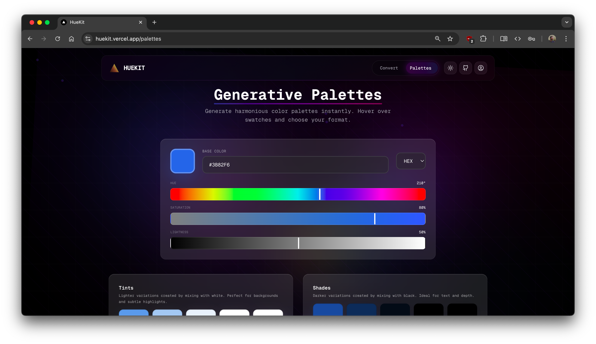

### A color tool that loves design

**Convert, manipulate, and explore colors with an elegant, designer-friendly interface**

[Try it Now](https://huekit.vercel.app/) • [Documentation](#features) • [Contributing](#contributing)

---

## Overview

HueKit is a modern color manipulation tool built for designers and developers who value precision and elegant interfaces. Whether you're converting between color formats, fine-tuning hues, or building complete palettes, HueKit provides a seamless experience with real-time visual feedback.

### Why HueKit?

- **Designer-First** — Beautiful UI that makes color manipulation feel natural
- **Real-Time** — Instant preview as you adjust any color parameter
- **Adaptive Themes** — Seamless light and dark modes for comfortable work
- **Responsive** — Perfect experience across all devices
- **Modern Stack** — Built with Next.js, TypeScript, and Tailwind CSS

---

## Features

### Color Converter

Transform colors effortlessly between multiple formats with precision and ease.

**Supported Formats:**
- **HEX** — Classic 6-digit hexadecimal notation
- **RGB** — Red, Green, Blue values (0-255)
- **HSL** — Hue (0-360°), Saturation (0-100%), Lightness (0-100%)

**Capabilities:**
- Real-time conversion across all formats
- Individual channel control with precise sliders
- Live color preview with instant feedback
- Integrated color picker for quick selection
- Copy values with a single click

**Light Mode:**

**Dark Mode:**

### Palette Generator

Create harmonious color palettes and explore color relationships.

**Features:**
- Generate complementary, analogous, and triadic color schemes
- Visual palette organization
- Save and manage your favorite palettes
- Share palettes with team members
- Export in multiple formats

**Light Mode:**

**Dark Mode:**

### Advanced Color Controls

Fine-tune every aspect of your colors with professional-grade controls:

- **Hue Slider**: Rotate through the complete color spectrum (0-360°)
- **Saturation Control**: Adjust color intensity from grayscale to full vibrancy
- **Lightness Adjustment**: Perfect balance from pure black to pure white
- **RGB Channels**: Direct manipulation of red, green, and blue values
- **Live Preview**: See changes instantly as you adjust

---

## Technology Stack

HueKit is built with cutting-edge technologies for optimal performance and developer experience:

| Technology | Purpose |
|------------|---------|
| **[Next.js 15](https://nextjs.org/)** | React framework with App Router |
| **[TypeScript](https://www.typescriptlang.org/)** | Type-safe development (94.9% coverage) |
| **[Tailwind CSS](https://tailwindcss.com/)** | Utility-first styling |
| **[shadcn/ui](https://ui.shadcn.com/)** | Beautiful, accessible components |
| **[Biome](https://biomejs.dev/)** | Fast linting and formatting |

---

## Usage Examples

### Converting Colors

1. **Navigate to the Converter** (default homepage)
2. **Input your color** using any format:
   - Enter HEX value directly
   - Adjust RGB sliders
   - Modify HSL parameters
   - Use the color picker
3. **Copy the output** in your desired format
4. **Experiment** with real-time adjustments

### Creating Palettes

1. **Go to the Palettes page** via navigation
2. **Select a base color** using any input method
3. **Generate schemes** - complementary, analogous, or custom

---

## Roadmap

We're constantly improving HueKit. Here's what's on the horizon:

- Additional color formats (CMYK, LAB, LCH)
- Color contrast checker (WCAG compliance)
- Gradient generator
- Cloud palette storage and sync
- API for programmatic access
- Color blindness simulator
- Native mobile apps
- Team collaboration features

---

## Contributing

We love contributions! Whether it's bug fixes, new features, or documentation improvements, all contributions are welcome.

### How to Contribute

1. **Fork the repository**
2. **Create a feature branch** (`git checkout -b feature/amazing-feature`)
3. **Make your changes**
4. **Commit with conventional commits** (`git commit -m 'feat: add amazing feature'`)
5. **Push to your branch** (`git push origin feature/amazing-feature`)
6. **Open a Pull Request**

### Development Guidelines

- Follow the existing code style (enforced by Biome)
- Write meaningful commit messages
- Add tests for new features
- Update documentation as needed
- Ensure all tests pass before submitting

---

## License

This project is licensed under the MIT License - see the [LICENSE](LICENSE) file for details.

---

## Acknowledgments

- Built with [Next.js](https://nextjs.org/) by Vercel
- UI components from [shadcn/ui](https://ui.shadcn.com/)
- Icons and illustrations from the open-source community
- Inspired by designers and developers who love beautiful tools

---

## Connect

- **Website**: [huekit.vercel.app](https://huekit.vercel.app/)
- **GitHub**: [@alfaaarex](https://github.com/alfaaarex)
- **Issues**: [Report bugs](https://github.com/alfaaarex/color-tool/issues)
- **Discussions**: [Share ideas](https://github.com/alfaaarex/color-tool/discussions)

---

**Made with care by designers, for designers**

Star this repo if you find it helpful

[Home](https://huekit.vercel.app/) • [Converter](https://huekit.vercel.app/) • [Palettes](https://huekit.vercel.app/palettes)

